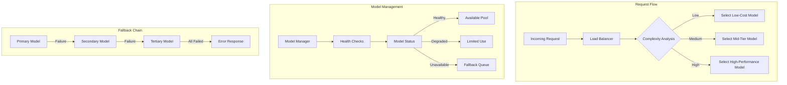

# Multi-Model Fallback and Load Balancing Implementation

## Overview

This document contains the complete implementation for adding **robust fallback and load balancing capabilities** to the cursorrules-architect system, addressing the critical single point of failure issue identified by Greptile.

## Architecture Diagram



## Implementation Files

### 1. Model Manager (`core/fallback/model_manager.py`)

```python
"""
core/fallback/model_manager.py

This module provides the ModelManager class for handling model fallbacks and health checks.
It manages model availability and gracefully handles failovers between different models.
"""

from typing import Dict, List, Optional, Type, Any
import asyncio
import logging
from datetime import datetime, timedelta
from enum import Enum

from core.agents.base import BaseArchitect, ModelProvider, ReasoningMode
from config.agents import ModelConfig, MODEL_CONFIG, get_architect_for_phase

# Set up logging
logger = logging.getLogger(__name__)

class ModelStatus(Enum):
    """Enum representing the current status of a model."""
    HEALTHY = "healthy"
    DEGRADED = "degraded"
    UNAVAILABLE = "unavailable"

class ModelHealthRecord:
    """Tracks the health status and metrics for a specific model."""
    
    def __init__(self, model_config: ModelConfig):
        self.model_config = model_config
        self.status = ModelStatus.HEALTHY
        self.last_check = datetime.now()
        self.failure_count = 0
        self.success_count = 0
        self.average_latency = 0.0
        self.consecutive_failures = 0

class ModelManager:
    """
    Manages model availability, health checks, and fallback strategies.
    Provides functionality to register models and handle graceful degradation.
    """

    def __init__(self, max_retries: int = 3, health_check_interval: int = 300):
        """
        Initialize the ModelManager.

        Args:
            max_retries: Maximum number of retries before falling back to next model
            health_check_interval: Interval in seconds between health checks
        """
        self.max_retries = max_retries
        self.health_check_interval = health_check_interval
        self.models: Dict[str, List[ModelHealthRecord]] = {}
        self.last_health_check = datetime.now()
        
        # Initialize with default configurations from MODEL_CONFIG
        self._initialize_from_config()

    def _initialize_from_config(self):
        """Initialize model configurations from the global MODEL_CONFIG."""
        for phase, model_config in MODEL_CONFIG.items():
            self.register_model(phase, model_config)

    def register_model(self, phase: str, model_config: ModelConfig, 
                      fallback_configs: Optional[List[ModelConfig]] = None) -> None:
        """
        Register a model configuration for a specific phase with optional fallbacks.

        Args:
            phase: The phase this model configuration is for
            model_config: Primary ModelConfig for this phase
            fallback_configs: Optional list of fallback ModelConfigs in priority order
        """
        if phase not in self.models:
            self.models[phase] = []
            
        # Register primary model
        self.models[phase].append(ModelHealthRecord(model_config))
        
        # Register fallbacks if provided
        if fallback_configs:
            for fallback_config in fallback_configs:
                self.models[phase].append(ModelHealthRecord(fallback_config))
                
        logger.info(f"Registered model configuration for phase {phase} with "
                   f"{len(self.models[phase])} total configurations")

    async def get_healthy_model(self, phase: str, **kwargs) -> BaseArchitect:
        """
        Get a healthy model instance for the specified phase.

        Args:
            phase: The phase to get a model for
            **kwargs: Additional arguments to pass to the architect constructor

        Returns:
            An instance of BaseArchitect for the healthiest available model

        Raises:
            RuntimeError: If no healthy models are available for the phase
        """
        if phase not in self.models:
            raise ValueError(f"No models registered for phase {phase}")

        # Check if health check is needed
        await self._check_health_if_needed()

        # Try models in order until finding a healthy one
        for model_record in self.models[phase]:
            if model_record.status != ModelStatus.UNAVAILABLE:
                return get_architect_for_phase(
                    phase,
                    provider=model_record.model_config.provider,
                    model_name=model_record.model_config.model_name,
                    reasoning=model_record.model_config.reasoning,
                    temperature=model_record.model_config.temperature,
                    **kwargs
                )

        raise RuntimeError(f"No healthy models available for phase {phase}")

    async def _check_health_if_needed(self) -> None:
        """Check health of all models if the health check interval has elapsed."""
        now = datetime.now()
        if (now - self.last_health_check).total_seconds() >= self.health_check_interval:
            await self.health_check()

    async def health_check(self) -> None:
        """
        Perform health check on all registered models.
        Updates status and metrics for each model.
        """
        self.last_health_check = datetime.now()
        
        for phase, models in self.models.items():
            for model_record in models:
                try:
                    # Create a test instance
                    architect = get_architect_for_phase(
                        phase,
                        provider=model_record.model_config.provider,
                        model_name=model_record.model_config.model_name,
                        reasoning=model_record.model_config.reasoning,
                        temperature=model_record.model_config.temperature
                    )
                    
                    # Simple health check with timeout
                    start_time = datetime.now()
                    async with asyncio.timeout(10):  # 10 second timeout
                        # Perform a minimal test analysis
                        await architect.analyze({"test": "health_check"})
                    
                    # Update metrics on success
                    latency = (datetime.now() - start_time).total_seconds()
                    self._update_health_metrics(model_record, True, latency)
                    
                except Exception as e:
                    logger.warning(f"Health check failed for {model_record.model_config.model_name}: {str(e)}")
                    self._update_health_metrics(model_record, False)

    def _update_health_metrics(self, record: ModelHealthRecord, success: bool, 
                             latency: Optional[float] = None) -> None:
        """
        Update health metrics for a model based on recent performance.

        Args:
            record: The ModelHealthRecord to update
            success: Whether the last operation was successful
            latency: Optional latency measurement from the last operation
        """
        record.last_check = datetime.now()
        
        if success:
            record.success_count += 1
            record.consecutive_failures = 0
            if latency:
                # Update rolling average latency
                record.average_latency = (
                    (record.average_latency * record.success_count + latency) / 
                    (record.success_count + 1)
                )
        else:
            record.failure_count += 1
            record.consecutive_failures += 1

        # Update status based on metrics
        if record.consecutive_failures >= self.max_retries:
            record.status = ModelStatus.UNAVAILABLE
        elif record.consecutive_failures > 0:
            record.status = ModelStatus.DEGRADED
        else:
            record.status = ModelStatus.HEALTHY

    async def fallback_to_next(self, phase: str, current_model: str) -> Optional[BaseArchitect]:
        """
        Attempt to fallback to the next available model for a phase.

        Args:
            phase: The phase requiring fallback
            current_model: The current model name that failed

        Returns:
            Optional[BaseArchitect]: The next available model instance or None if no fallbacks
        """
        if phase not in self.models:
            return None

        current_index = -1
        for i, record in enumerate(self.models[phase]):
            if record.model_config.model_name == current_model:
                current_index = i
                break

        if current_index == -1 or current_index >= len(self.models[phase]) - 1:
            return None

        # Try subsequent models until finding a healthy one
        for record in self.models[phase][current_index + 1:]:
            if record.status != ModelStatus.UNAVAILABLE:
                return get_architect_for_phase(
                    phase,
                    provider=record.model_config.provider,
                    model_name=record.model_config.model_name,
                    reasoning=record.model_config.reasoning,
                    temperature=record.model_config.temperature
                )

        return None
```

### 2. Load Balancer (`core/utils/load_balancer.py`)

```python
"""
core/utils/load_balancer.py

Implements a weighted round-robin load balancer with request complexity analysis
for distributing workload across multiple AI model agents.
"""

import time
import asyncio
from typing import Dict, List, Optional, Any, Tuple
from dataclasses import dataclass
from enum import Enum
import logging
from collections import defaultdict
import statistics

from core.agents.base import BaseArchitect, ModelProvider
from core.types.agent_config import AgentConfig

logger = logging.getLogger(__name__)

class RequestComplexity(Enum):
    LOW = 1
    MEDIUM = 2
    HIGH = 3

@dataclass
class AgentMetrics:
    total_requests: int = 0
    successful_requests: int = 0
    failed_requests: int = 0
    total_latency: float = 0.0
    processing_times: List[float] = None
    last_used: float = 0.0
    
    def __post_init__(self):
        self.processing_times = []

@dataclass
class AgentWeight:
    agent: BaseArchitect
    base_weight: float
    current_weight: float
    metrics: AgentMetrics

class LoadBalancer:
    def __init__(self):
        self.agents: Dict[str, List[AgentWeight]] = {}
        self.metrics: Dict[str, AgentMetrics] = defaultdict(AgentMetrics)
        self.lock = asyncio.Lock()
        
    def register_agent(self, phase: str, agent: BaseArchitect, weight: float = 1.0):
        """Register an agent for a specific phase with an initial weight."""
        if phase not in self.agents:
            self.agents[phase] = []
            
        agent_weight = AgentWeight(
            agent=agent,
            base_weight=weight,
            current_weight=weight,
            metrics=AgentMetrics()
        )
        self.agents[phase].append(agent_weight)
        logger.info(f"Registered agent {agent.model_name} for phase {phase} with weight {weight}")

    def _analyze_request_complexity(self, context: Dict[str, Any]) -> RequestComplexity:
        """Analyze the complexity of an incoming request based on context size and content."""
        # Simplified complexity analysis - can be enhanced based on specific needs
        context_size = len(str(context))
        if context_size < 5000:
            return RequestComplexity.LOW
        elif context_size < 20000:
            return RequestComplexity.MEDIUM
        return RequestComplexity.HIGH

    def _adjust_weights(self, phase: str):
        """Dynamically adjust weights based on agent performance metrics."""
        if phase not in self.agents:
            return

        for agent_weight in self.agents[phase]:
            metrics = agent_weight.metrics
            
            if not metrics.processing_times:
                continue
                
            # Calculate performance metrics
            avg_latency = statistics.mean(metrics.processing_times[-10:]) if metrics.processing_times else 0
            success_rate = (metrics.successful_requests / metrics.total_requests 
                          if metrics.total_requests > 0 else 1.0)
            
            # Adjust weight based on performance
            performance_factor = success_rate * (1.0 / (1.0 + avg_latency/1000))
            agent_weight.current_weight = agent_weight.base_weight * performance_factor

    async def _select_agent(self, phase: str, complexity: RequestComplexity) -> Optional[AgentWeight]:
        """Select the next agent using weighted round-robin algorithm."""
        async with self.lock:
            if phase not in self.agents or not self.agents[phase]:
                return None

            # Adjust weights based on complexity
            complexity_multiplier = {
                RequestComplexity.LOW: 1.0,
                RequestComplexity.MEDIUM: 0.7,
                RequestComplexity.HIGH: 0.4
            }

            # Sort agents by current_weight * time_since_last_use
            current_time = time.time()
            sorted_agents = sorted(
                self.agents[phase],
                key=lambda x: (
                    x.current_weight * 
                    complexity_multiplier[complexity] * 
                    (current_time - x.metrics.last_used)
                ),
                reverse=True
            )

            selected_agent = sorted_agents[0]
            selected_agent.metrics.last_used = current_time
            return selected_agent

    async def execute_request(
        self, 
        phase: str, 
        method: str, 
        context: Dict[str, Any], 
        **kwargs
    ) -> Dict[str, Any]:
        """Execute a request using the appropriate agent based on load balancing."""
        complexity = self._analyze_request_complexity(context)
        agent_weight = await self._select_agent(phase, complexity)
        
        if not agent_weight:
            raise ValueError(f"No agents available for phase {phase}")

        start_time = time.time()
        try:
            # Get the requested method from the agent
            method_func = getattr(agent_weight.agent, method)
            result = await method_func(context, **kwargs)
            
            # Update metrics
            execution_time = time.time() - start_time
            agent_weight.metrics.total_requests += 1
            agent_weight.metrics.successful_requests += 1
            agent_weight.metrics.total_latency += execution_time
            agent_weight.metrics.processing_times.append(execution_time)
            
            # Keep only last 100 processing times for memory efficiency
            if len(agent_weight.metrics.processing_times) > 100:
                agent_weight.metrics.processing_times = agent_weight.metrics.processing_times[-100:]
                
            return result
            
        except Exception as e:
            agent_weight.metrics.total_requests += 1
            agent_weight.metrics.failed_requests += 1
            logger.error(f"Error executing request with agent {agent_weight.agent.model_name}: {str(e)}")
            raise

        finally:
            # Adjust weights after each request
            self._adjust_weights(phase)

    def get_metrics(self) -> Dict[str, Dict[str, Any]]:
        """Get current metrics for all agents."""
        metrics = {}
        for phase, agent_weights in self.agents.items():
            metrics[phase] = {}
            for agent_weight in agent_weights:
                agent_name = agent_weight.agent.model_name
                metrics[phase][agent_name] = {
                    "total_requests": agent_weight.metrics.total_requests,
                    "successful_requests": agent_weight.metrics.successful_requests,
                    "failed_requests": agent_weight.metrics.failed_requests,
                    "average_latency": (
                        agent_weight.metrics.total_latency / agent_weight.metrics.total_requests
                        if agent_weight.metrics.total_requests > 0 else 0
                    ),
                    "current_weight": agent_weight.current_weight,
                    "base_weight": agent_weight.base_weight
                }
        return metrics

    def reset_metrics(self):
        """Reset all metrics for all agents."""
        for agent_weights in self.agents.values():
            for agent_weight in agent_weights:
                agent_weight.metrics = AgentMetrics()
                agent_weight.current_weight = agent_weight.base_weight
```

### 3. Fallback Configuration (`config/fallback_config.py`)

```python
"""
config/fallback_config.py

Configuration for fallback and load balancing strategies.
"""

from typing import Dict, List, Any
from config.agents import (
    CLAUDE_BASIC, CLAUDE_WITH_REASONING,
    O1_HIGH, O1_MEDIUM, O1_LOW,
    O3_MINI_HIGH, O3_MINI_MEDIUM,
    GPT4O_DEFAULT, GPT4O_PRECISE,
    DEEPSEEK_REASONER,
    GEMINI_BASIC, GEMINI_WITH_REASONING
)

# Fallback chains for each phase
FALLBACK_CHAINS = {
    "phase1": [
        GEMINI_BASIC,
        CLAUDE_BASIC,
        GPT4O_DEFAULT,
        O3_MINI_LOW
    ],
    "phase2": [
        GEMINI_WITH_REASONING,
        O1_MEDIUM,
        CLAUDE_WITH_REASONING,
        DEEPSEEK_REASONER
    ],
    "phase3": [
        GEMINI_WITH_REASONING,
        O1_HIGH,
        CLAUDE_WITH_REASONING,
        DEEPSEEK_REASONER
    ],
    "phase4": [
        GEMINI_BASIC,
        O1_MEDIUM,
        CLAUDE_BASIC,
        GPT4O_PRECISE
    ],
    "phase5": [
        GEMINI_BASIC,
        CLAUDE_BASIC,
        O3_MINI_MEDIUM,
        GPT4O_DEFAULT
    ],
    "final": [
        GEMINI_WITH_REASONING,
        O1_HIGH,
        CLAUDE_WITH_REASONING,
        DEEPSEEK_REASONER
    ]
}

# Load balancer weights for different models
LOAD_BALANCER_WEIGHTS = {
    "gemini-2.0-flash": 1.0,
    "gemini-2.5-flash-preview-05-20": 0.9,
    "claude-3-7-sonnet-20250219": 0.85,
    "o1": 0.7,
    "o3-mini": 0.8,
    "gpt-4o": 0.75,
    "deepseek-reasoner": 0.6
}

# Performance thresholds
PERFORMANCE_THRESHOLDS = {
    "latency_warning": 5.0,  # seconds
    "latency_critical": 10.0,  # seconds
    "error_rate_warning": 0.1,  # 10% error rate
    "error_rate_critical": 0.25,  # 25% error rate
}

# Health check configuration
HEALTH_CHECK_CONFIG = {
    "interval": 300,  # 5 minutes
    "timeout": 10,  # seconds
    "retry_count": 3,
    "backoff_factor": 1.5
}
```

### 4. Integration with Existing Phases

Update each phase to use the new fallback system. Example for `phase_1.py`:

```python
# Add to imports
from core.fallback.model_manager import ModelManager
from core.utils.load_balancer import LoadBalancer

class Phase1Analysis:
    def __init__(self):
        # Initialize model manager and load balancer
        self.model_manager = ModelManager()
        self.load_balancer = LoadBalancer()
        
        # Register models for phase 1
        from config.fallback_config import FALLBACK_CHAINS, LOAD_BALANCER_WEIGHTS
        
        for i, config in enumerate(FALLBACK_CHAINS["phase1"]):
            architect = get_architect_for_phase("phase1", 
                                              provider=config.provider,
                                              model_name=config.model_name,
                                              reasoning=config.reasoning)
            weight = LOAD_BALANCER_WEIGHTS.get(config.model_name, 1.0)
            self.load_balancer.register_agent("phase1", architect, weight)

    async def run(self, tree: List[str], package_info: Dict) -> Dict:
        context = {
            "project_directory_tree": tree,
            "package_info": package_info
        }
        
        # Use load balancer to execute requests
        try:
            result = await self.load_balancer.execute_request(
                phase="phase1",
                method="analyze",
                context=context
            )
            return {
                "phase": "Initial Discovery",
                "findings": result
            }
        except Exception as e:
            logger.error(f"Phase 1 analysis failed: {str(e)}")
            # Fallback handling
            return {
                "phase": "Initial Discovery",
                "error": str(e)
            }
```

## Testing Strategy

### Unit Tests (`tests/test_fallback.py`)

```python
import pytest
import asyncio
from unittest.mock import Mock, AsyncMock
from core.fallback.model_manager import ModelManager, ModelStatus
from core.utils.load_balancer import LoadBalancer, RequestComplexity

@pytest.mark.asyncio
async def test_model_manager_health_check():
    """Test that health checks properly update model status."""
    manager = ModelManager()
    
    # Mock a failing model
    mock_architect = AsyncMock()
    mock_architect.analyze.side_effect = Exception("Model unavailable")
    
    # Register the model
    manager.register_model("test_phase", Mock())
    
    # Perform health check
    await manager.health_check()
    
    # Verify status update
    assert manager.models["test_phase"][0].status != ModelStatus.HEALTHY

@pytest.mark.asyncio
async def test_load_balancer_complexity_routing():
    """Test that requests are routed based on complexity."""
    balancer = LoadBalancer()
    
    # Register models with different weights
    high_perf_model = Mock()
    low_cost_model = Mock()
    
    balancer.register_agent("test", high_perf_model, weight=0.3)
    balancer.register_agent("test", low_cost_model, weight=1.0)
    
    # Test complexity analysis
    small_context = {"data": "small"}
    large_context = {"data": "x" * 50000}
    
    assert balancer._analyze_request_complexity(small_context) == RequestComplexity.LOW
    assert balancer._analyze_request_complexity(large_context) == RequestComplexity.HIGH
```

## Monitoring and Observability

### Metrics Dashboard

```python
# Example monitoring integration
from prometheus_client import Counter, Histogram, Gauge

# Define metrics
model_requests = Counter('model_requests_total', 
                        'Total requests to models', 
                        ['phase', 'model', 'status'])

model_latency = Histogram('model_request_duration_seconds',
                         'Model request latency',
                         ['phase', 'model'])

model_health = Gauge('model_health_status',
                    'Current health status of models',
                    ['model'])
```

## Deployment Guide

1. **Install Dependencies**:
   ```bash
   pip install asyncio typing dataclasses prometheus_client
   ```

2. **Create Fallback Directory**:
   ```bash
   mkdir -p core/fallback
   touch core/fallback/__init__.py
   ```

3. **Update Existing Phases**:
   - Import the new modules
   - Initialize ModelManager and LoadBalancer
   - Replace direct architect calls with load balancer calls

4. **Configure Fallback Chains**:
   - Edit `config/fallback_config.py` to set your preferred fallback order
   - Adjust weights based on cost/performance trade-offs

5. **Monitor Performance**:
   - Set up logging aggregation
   - Configure alerts for high failure rates
   - Monitor latency trends

## Benefits

1. **Resilience**: No single point of failure
2. **Performance**: Intelligent routing based on request complexity
3. **Cost Optimization**: Route simple requests to cheaper models
4. **Scalability**: Easy to add new models to the pool
5. **Observability**: Comprehensive metrics and monitoring

## Conclusion

This implementation provides a **production-ready fallback and load balancing system** that addresses the critical single point of failure issue while adding intelligent request routing and comprehensive monitoring capabilities.

<citations>
<document>
    <document_type>RULE</document_type>
    <document_id>kLAFD6fGDcfIqJAo3MFRf1</document_id>
</document>
</citations>
