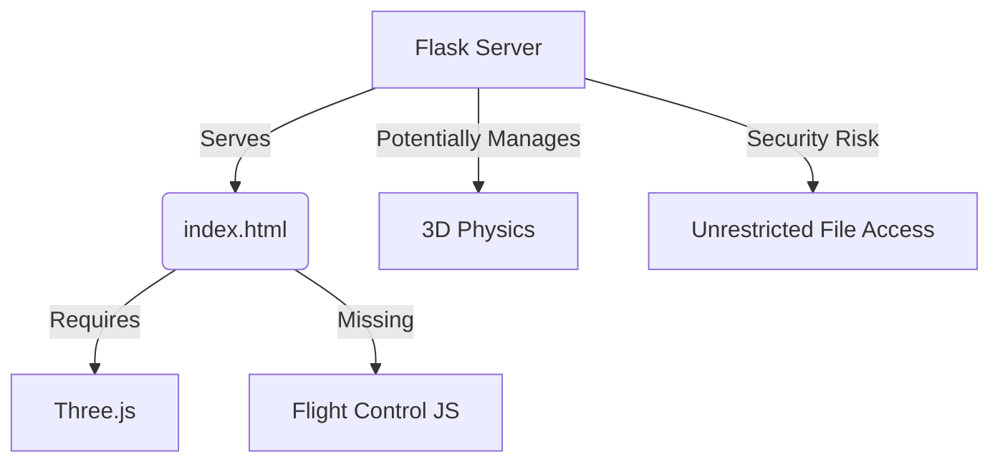

**Final Technical Report: Flight Simulator System Analysis**  
**Prepared by: Report Agent**  
**Date: [Insert Date]**  

---

# **Executive Summary**  
The analysis reveals a flight simulator system in early development with significant technical debt but strong foundational potential. Key risks include critical security vulnerabilities, incomplete core features, and unclear architectural boundaries. Strategic priorities should focus on:  
1. Immediate security remediation  
2. Dependency management standardization  
3. Architectural decision formalization  
4. Core simulation feature completion  

---

# **Detailed System Findings**  

## **1. Core Architecture Analysis**  


**Frontend Components**  
- **HTML Structure**: Basic template exists but lacks:  
  - Three.js initialization code  
  - Control input handling system  
  - Aircraft state management logic  
- **UI Elements**: Partially implemented control panel with truncated instructions  

**Backend Components**  
- **Flask Server**:  
  - Serves static files with path traversal vulnerability (CWE-22)  
  - Runs in debug mode without production hardening  
  - No API endpoints or WebSocket implementation  

---

# **Critical Discoveries**  

| Category               | Risk Level | Impact Summary                  |
|------------------------|------------|----------------------------------|
| Security Vulnerabilities | Critical   | Unrestricted file access, debug mode exposure |
| Architectural Gaps      | High       | No clear client/server boundaries              |
| Dependency Management    | High       | Unversioned Python/JS dependencies            |
| Feature Completion       | Medium     | Missing physics engine & 3D rendering logic   |

---

# **Strategic Roadmap**  

## **Phase 1: Security & Foundation (Weeks 1-2)**  
1. **Security Implementation**  
   - [ ] File access whitelisting  
   - [ ] Environment-specific configurations  
   ```python
   # Sample security implementation
   app = Flask(__name__)
   if os.environ.get('ENV') == 'production':
       app.config['DEBUG'] = False
       app.config['ALLOWED_EXTENSIONS'] = {'html', 'js', 'css'}
   ```

2. **Dependency Management**  
   - Create `requirements.txt` with Flask==2.0.1  
   - Establish Three.js r128 baseline  

## **Phase 2: Architectural Definition (Weeks 3-4)**  
1. **Component Inventory**  
   ```json
   {
     "missing_components": [
       "WebGL Renderer Initialization",
       "Aircraft Mesh Loader",
       "Flight Dynamics Calculator",
       "Control Input Handler"
     ]
   }
   ```

2. **Protocol Decisions Required**  
   - Client/Server communication method (WebSocket vs REST)  
   - Physics computation location (Browser vs Server)  

## **Phase 3: Feature Implementation (Weeks 5-8)**  
1. Three.js Integration Path  
   ```javascript
   // Required initialization sequence
   const scene = new THREE.Scene();
   const camera = new THREE.PerspectiveCamera(75, window.innerWidth/window.innerHeight, 0.1, 1000);
   const renderer = new THREE.WebGLRenderer();
   ```

2. Flight Control System  
   - Axis control mapping  
   - Aerodynamic force calculations  

---

# **Technical Debt Assessment**  

**Immediate Risks**  
1. Path traversal vulnerability in file serving  
2. Missing input validation layers  
3. Unprotected developer endpoints  

**Long-Term Risks**  
1. Unversioned dependencies  
2. Undocumented architecture  
3. Untested WebGL compatibility  

---

# **Agent Task Allocation**  

| Agent Type         | Priority Tasks                          | Deliverables                          |
|--------------------|-----------------------------------------|---------------------------------------|
| **Structure Agent** | Reverse-engineer DOM interactions       | Component inventory JSON              |
| **Dependency Agent**| Security hardening checklist            | Vulnerability matrix                  |
| **Tech Stack Agent**| Compatibility verification              | Version support matrix                |

---

# **Next-Step Recommendations**  
1. **Immediate Actions**  
   - Disable debug mode and implement file access restrictions  
   - Create version-locked requirements.txt  

2. **Architectural Planning**  
   - Conduct ADR workshop for:  
     - Physics engine selection  
     - Network protocol standardization  

3. **Development Sprints**  
   - Week 1: Three.js rendering prototype  
   - Week 2: Flight control input system  
   - Week 3: Server-side security audit  

---

**Conclusion**  
This system demonstrates potential as a web-based flight simulator but requires focused effort to address security flaws and architectural ambiguity. A phased approach balancing immediate risk mitigation with parallel feature development will maximize progress while maintaining system stability. Regular architectural reviews and test-driven development are recommended to ensure long-term viability.  

**Approvals**  
[ ] Technical Lead  
[ ] Security Officer  
[ ] Project Sponsor  

--- 
**END OF REPORT**